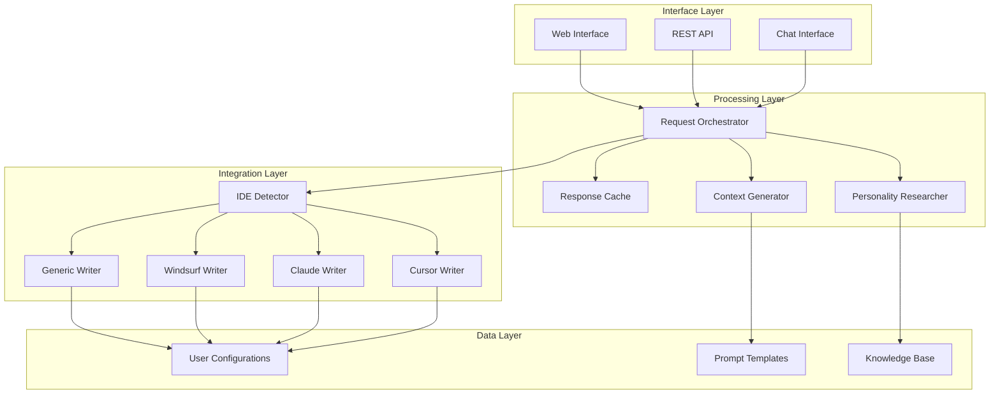

# Design Document

## Overview

The Agent Personality System is designed as a modular service that enhances coding agents by injecting personality traits into their responses. The system follows functional programming principles with pure functions, immutable data structures, and composition patterns. The architecture emphasizes modularity with clear separation between input handling, personality research, context generation, and IDE integration components.

## Development Principles

- **Functional Programming**: Prefer pure functions, immutable data structures, and function composition
- **Modern Python**: Full type hints, async/await patterns, dataclasses/Pydantic models
- **Avoid Classes**: Use functions and modules unless required by frameworks (FastAPI, Pydantic)
- **Modularity**: Clear separation of concerns with focused, testable modules
- **Vectorization**: Leverage NumPy/Pandas for data processing where applicable

## Architecture

The system consists of four main layers:

1. **Interface Layer**: Handles multiple input methods (web UI, REST API, chat interface)
2. **Processing Layer**: Manages personality research, context generation, and request orchestration
3. **Integration Layer**: Handles IDE-specific file writing and format conversion
4. **Data Layer**: Manages personality knowledge base, user configurations, and caching



## Components and Interfaces

### Interface Layer Components

#### Web Interface
- **Technology**: React-based SPA with TypeScript
- **Responsibilities**: 
  - Personality input form with validation
  - Real-time feedback and progress indicators
  - Configuration management UI
  - IDE integration status display
- **API Integration**: Communicates with REST API backend

#### REST API
- **Technology**: Python with FastAPI
- **Endpoints**:
  - `POST /api/personality` - Create personality configuration
  - `GET /api/personality/:id` - Retrieve configuration
  - `PUT /api/personality/:id` - Update configuration
  - `DELETE /api/personality/:id` - Remove configuration
  - `POST /api/personality/research` - Research personality only
  - `GET /api/ide/detect` - Detect IDE environment
- **Authentication**: API key-based for programmatic access

#### Chat Interface
- **Technology**: WebSocket-based real-time communication
- **Responsibilities**:
  - Natural language processing for personality requests
  - Conversational refinement of traits
  - Context-aware response generation
- **Integration**: Connects to same processing layer as other interfaces

### Processing Layer Components

#### Request Orchestrator
- **Responsibilities**:
  - Route requests between components
  - Manage processing pipeline
  - Handle error propagation and recovery
  - Coordinate async operations
- **Pattern**: Command pattern with async/await

#### Personality Researcher
- **Data Sources**:
  - Wikipedia API for biographical information
  - Character database APIs (Marvel, DC, etc.)
  - Curated personality archetype database
  - Web scraping for additional context (rate-limited)
- **Research Strategy**:
  - Primary: Structured API calls
  - Secondary: Cached knowledge base lookup
  - Fallback: Web search with content extraction
- **Output**: Structured personality profile with traits, mannerisms, and communication style

#### Context Generator
- **Input**: Personality research results
- **Processing**:
  - Template-based prompt generation
  - Trait-to-behavior mapping
  - Style consistency validation
  - Technical accuracy preservation
- **Output**: LLM-ready context strings formatted for different agent types

### Integration Layer Components

#### IDE Detector
- **Detection Methods**:
  - File system analysis (look for IDE-specific files/folders)
  - Environment variable inspection
  - User-provided hints
  - Manual selection fallback
- **Supported IDEs**: Cursor, Claude, Windsurf, VS Code, others

#### IDE Writers
Each writer follows a functional interface pattern:
```python
from typing import Protocol, Awaitable
from dataclasses import dataclass

class IDEWriter(Protocol):
    async def detect(self, project_path: Path) -> bool: ...
    async def write(self, config: PersonalityConfig, project_path: Path) -> WriteResult: ...
    async def validate(self, project_path: Path) -> ValidationResult: ...

# Functional implementations
async def write_cursor_config(config: PersonalityConfig, project_path: Path) -> WriteResult
async def write_claude_config(config: PersonalityConfig, project_path: Path) -> WriteResult
async def write_windsurf_config(config: PersonalityConfig, project_path: Path) -> WriteResult
async def write_generic_config(config: PersonalityConfig, project_path: Path) -> WriteResult
```

- **Cursor Writer**: Creates `.mdc` files in `/cursor/rules/`
- **Claude Writer**: Manages `CLAUDE.md` file
- **Windsurf Writer**: Handles `.windsurf` configuration
- **Generic Writer**: Provides multiple format options

## Data Models

### Core Models

```python
from datetime import datetime
from enum import Enum
from typing import Optional, List
from pydantic import BaseModel, Field

class SourceType(str, Enum):
    WEB = "web"
    API = "api"
    CHAT = "chat"

class PersonalityType(str, Enum):
    CELEBRITY = "celebrity"
    FICTIONAL = "fictional"
    ARCHETYPE = "archetype"
    CUSTOM = "custom"

class FormalityLevel(str, Enum):
    CASUAL = "casual"
    FORMAL = "formal"
    MIXED = "mixed"

class VerbosityLevel(str, Enum):
    CONCISE = "concise"
    MODERATE = "moderate"
    VERBOSE = "verbose"

class TechnicalLevel(str, Enum):
    BEGINNER = "beginner"
    INTERMEDIATE = "intermediate"
    EXPERT = "expert"

class PersonalityRequest(BaseModel):
    id: str
    description: str
    user_id: Optional[str] = None
    timestamp: datetime
    source: SourceType

class PersonalityTrait(BaseModel):
    category: str
    trait: str
    intensity: int = Field(ge=1, le=10)  # 1-10 scale
    examples: List[str]

class CommunicationStyle(BaseModel):
    tone: str
    formality: FormalityLevel
    verbosity: VerbosityLevel
    technical_level: TechnicalLevel

class ResearchSource(BaseModel):
    type: str
    url: Optional[str] = None
    confidence: float = Field(ge=0.0, le=1.0)
    last_updated: datetime

class PersonalityProfile(BaseModel):
    id: str
    name: str
    type: PersonalityType
    traits: List[PersonalityTrait]
    communication_style: CommunicationStyle
    mannerisms: List[str]
    sources: List[ResearchSource]

class PersonalityConfig(BaseModel):
    id: str
    profile: PersonalityProfile
    context: str
    ide_type: str
    file_path: str
    active: bool
    created_at: datetime
    updated_at: datetime

### Research Models

class ResearchResult(BaseModel):
    query: str
    profiles: List[PersonalityProfile]
    confidence: float = Field(ge=0.0, le=1.0)
    suggestions: List[str]
    errors: List[str]
```

## Error Handling

### Error Categories

1. **Input Validation Errors**
   - Invalid personality descriptions
   - Malformed API requests
   - Missing required fields

2. **Research Errors**
   - API rate limiting
   - Network connectivity issues
   - Insufficient information found
   - Ambiguous personality requests

3. **Integration Errors**
   - IDE detection failures
   - File system permission issues
   - Unsupported IDE versions

4. **System Errors**
   - Database connectivity
   - Service unavailability
   - Resource exhaustion

### Error Handling Strategy

- **Graceful Degradation**: Provide partial results when possible
- **Retry Logic**: Exponential backoff for transient failures
- **Fallback Options**: Alternative research sources and manual configuration
- **User Communication**: Clear error messages with suggested actions

### Error Response Format

```python
class ErrorResponse(BaseModel):
    error: ErrorDetail
    request_id: str
    timestamp: datetime

class ErrorDetail(BaseModel):
    code: str
    message: str
    details: Optional[dict] = None
    suggestions: List[str] = []
```

## Testing Strategy

### Unit Testing
- **Components**: All processing layer functions and modules
- **Coverage Target**: 90%+ for core business logic
- **Mocking**: External APIs and file system operations using pytest-mock
- **Tools**: pytest with pytest-asyncio for async testing, coverage.py for coverage reporting

### Integration Testing
- **API Endpoints**: Full request/response cycle testing with FastAPI TestClient
- **IDE Writers**: File creation and validation testing with temporary directories
- **Research Pipeline**: End-to-end personality research flow testing
- **Tools**: pytest with httpx for async API testing, pytest-tmp-path for file testing

### End-to-End Testing
- **User Workflows**: Complete personality configuration scenarios
- **Cross-browser**: Web interface compatibility testing
- **IDE Integration**: Real IDE environment testing
- **Tools**: Playwright for web UI, custom Python scripts for IDE testing

### Performance Testing
- **Research Speed**: Personality lookup and generation timing with pytest-benchmark
- **Concurrent Users**: API load testing with locust
- **Memory Usage**: Long-running service monitoring with memory-profiler
- **Tools**: locust for load testing, py-spy for profiling

### Security Testing
- **Input Validation**: Injection prevention and data validation testing
- **API Security**: Rate limiting and authentication testing
- **File System**: Path traversal and permission validation
- **Tools**: bandit for security linting, custom security test suites with pytest