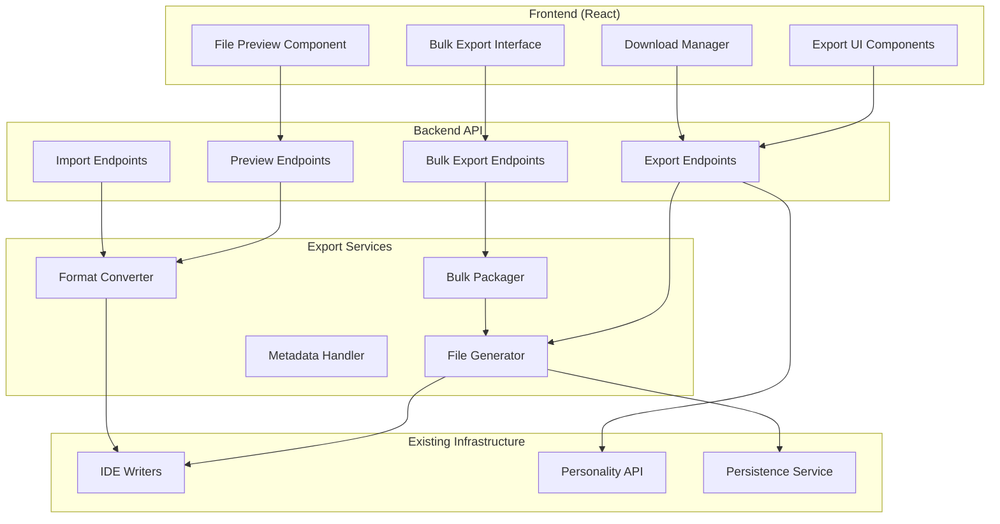

# Design Document

## Overview

The IDE Export System extends the existing Agent Personality System by adding web-based export functionality that allows users to download personality configurations in IDE-specific formats. The system leverages the existing IDE writers infrastructure while adding new API endpoints, frontend components, and file generation capabilities to provide a seamless export experience.

The design follows the established functional programming patterns in the codebase, using pure functions, immutable data structures, and composition patterns. It integrates with the existing FastAPI backend and React frontend while maintaining backward compatibility with current functionality.

## Architecture

The IDE Export System adds three main components to the existing architecture:

1. **Export API Layer**: New FastAPI endpoints for generating and serving IDE-specific configuration files
2. **Export Service Layer**: Functional modules for file generation, formatting, and metadata handling
3. **Export UI Layer**: React components for export interface, preview, and download management



## Components and Interfaces

### Export API Layer

#### Export Endpoints
New FastAPI endpoints extending the existing personality router:

```python
# New endpoints in src/covibe/api/personality.py

@router.get("/{personality_id}/export/{ide_type}")
async def export_personality_config(
    personality_id: str,
    ide_type: str,
    format_options: Optional[Dict[str, Any]] = None
) -> FileResponse

@router.get("/{personality_id}/export/{ide_type}/preview")
async def preview_personality_export(
    personality_id: str,
    ide_type: str,
    format_options: Optional[Dict[str, Any]] = None
) -> Dict[str, Any]

@router.post("/export/bulk")
async def bulk_export_personalities(
    export_request: BulkExportRequest
) -> FileResponse

@router.post("/import")
async def import_personality_config(
    file: UploadFile,
    ide_type: str
) -> PersonalityConfigResponse
```

#### Request/Response Models
```python
class ExportFormatOptions(BaseModel):
    """Options for customizing export format."""
    file_name: Optional[str] = None
    include_metadata: bool = True
    include_instructions: bool = True
    custom_header: Optional[str] = None

class BulkExportRequest(BaseModel):
    """Request for bulk export operations."""
    personality_ids: List[str]
    ide_types: List[str]
    format_options: Optional[ExportFormatOptions] = None
    include_readme: bool = True

class ExportPreviewResponse(BaseModel):
    """Response for export preview."""
    content: str
    file_name: str
    file_size: int
    placement_instructions: List[str]
    metadata: Dict[str, Any]
```

### Export Service Layer

#### File Generator Service
Functional service for generating IDE-specific configuration files:

```python
# New module: src/covibe/services/export_generator.py

from typing import Dict, Any, Optional
from pathlib import Path
from ..models.core import PersonalityConfig
from ..integrations.ide_writers import write_cursor_config, write_claude_config, write_windsurf_config

async def generate_export_file(
    config: PersonalityConfig,
    ide_type: str,
    format_options: Optional[ExportFormatOptions] = None
) -> ExportResult:
    """Generate IDE-specific configuration file content."""
    
async def generate_preview_content(
    config: PersonalityConfig,
    ide_type: str,
    format_options: Optional[ExportFormatOptions] = None
) -> PreviewResult:
    """Generate preview of export content without file creation."""

async def generate_placement_instructions(
    ide_type: str,
    file_name: str,
    config: PersonalityConfig
) -> List[str]:
    """Generate step-by-step placement instructions for IDE integration."""

async def generate_bulk_export(
    configs: List[PersonalityConfig],
    ide_types: List[str],
    format_options: Optional[ExportFormatOptions] = None
) -> BulkExportResult:
    """Generate bulk export package with multiple configurations."""
```

#### Format Converter Service
Service for converting between different IDE formats and parsing imports:

```python
# New module: src/covibe/services/format_converter.py

async def convert_to_ide_format(
    config: PersonalityConfig,
    target_ide: str,
    source_ide: Optional[str] = None
) -> ConversionResult:
    """Convert personality config to specific IDE format."""

async def parse_imported_config(
    file_content: str,
    source_ide: str
) -> PersonalityConfig:
    """Parse imported IDE configuration file back to PersonalityConfig."""

async def detect_ide_format(
    file_content: str,
    file_name: str
) -> IDEFormatDetectionResult:
    """Detect IDE format from file content and name."""
```

#### Metadata Handler Service
Service for managing export metadata and versioning:

```python
# New module: src/covibe/services/export_metadata.py

async def generate_export_metadata(
    config: PersonalityConfig,
    ide_type: str,
    export_timestamp: datetime
) -> ExportMetadata:
    """Generate comprehensive metadata for exported configuration."""

async def format_metadata_for_ide(
    metadata: ExportMetadata,
    ide_type: str
) -> str:
    """Format metadata as comments appropriate for IDE format."""

async def extract_metadata_from_import(
    file_content: str,
    ide_type: str
) -> Optional[ExportMetadata]:
    """Extract metadata from imported configuration file."""
```

### Export UI Layer

#### Export Interface Component
Main component for initiating exports from personality configurations:

```typescript
// New component: web/src/components/PersonalityExportInterface.tsx

interface PersonalityExportInterfaceProps {
  config: PersonalityConfig;
  onExportComplete?: (result: ExportResult) => void;
}

const PersonalityExportInterface: React.FC<PersonalityExportInterfaceProps> = ({
  config,
  onExportComplete
}) => {
  // Component implementation
};
```

#### Export Preview Component
Component for previewing export content before download:

```typescript
// New component: web/src/components/ExportPreview.tsx

interface ExportPreviewProps {
  config: PersonalityConfig;
  ideType: string;
  formatOptions?: ExportFormatOptions;
  onDownload: () => void;
  onCancel: () => void;
}

const ExportPreview: React.FC<ExportPreviewProps> = ({
  config,
  ideType,
  formatOptions,
  onDownload,
  onCancel
}) => {
  // Component implementation with syntax highlighting
};
```

#### Bulk Export Manager
Component for managing bulk export operations:

```typescript
// New component: web/src/components/BulkExportManager.tsx

interface BulkExportManagerProps {
  availableConfigs: PersonalityConfig[];
  onExportComplete?: (result: BulkExportResult) => void;
}

const BulkExportManager: React.FC<BulkExportManagerProps> = ({
  availableConfigs,
  onExportComplete
}) => {
  // Component implementation
};
```

## Data Models

### Export-Specific Models

```python
# Extensions to src/covibe/models/core.py

class ExportFormatOptions(BaseModel):
    """Options for customizing export format."""
    file_name: Optional[str] = None
    include_metadata: bool = True
    include_instructions: bool = True
    custom_header: Optional[str] = None
    preserve_comments: bool = True

class ExportResult(BaseModel):
    """Result of export operation."""
    success: bool
    content: str
    file_name: str
    file_size: int
    mime_type: str
    placement_instructions: List[str]
    metadata: Dict[str, Any]
    error: Optional[str] = None

class PreviewResult(BaseModel):
    """Result of preview generation."""
    content: str
    file_name: str
    file_size: int
    syntax_language: str
    placement_instructions: List[str]
    metadata: Dict[str, Any]

class BulkExportResult(BaseModel):
    """Result of bulk export operation."""
    success: bool
    zip_content: bytes
    file_name: str
    file_size: int
    included_configs: List[str]
    readme_content: str
    error: Optional[str] = None

class ExportMetadata(BaseModel):
    """Metadata for exported configurations."""
    export_version: str
    personality_id: str
    personality_name: str
    ide_type: str
    exported_at: datetime
    exported_by: Optional[str]
    original_created_at: datetime
    llm_generated: bool
    llm_provider: Optional[str]
    confidence: Optional[float]
    checksum: str

class ConversionResult(BaseModel):
    """Result of format conversion."""
    success: bool
    converted_content: str
    target_format: str
    conversion_notes: List[str]
    error: Optional[str] = None

class IDEFormatDetectionResult(BaseModel):
    """Result of IDE format detection."""
    detected_ide: str
    confidence: float
    format_indicators: List[str]
    supported: bool
```

### Frontend Type Extensions

```typescript
// Extensions to web/src/types/personality.ts

export interface ExportFormatOptions {
  fileName?: string;
  includeMetadata: boolean;
  includeInstructions: boolean;
  customHeader?: string;
  preserveComments: boolean;
}

export interface ExportResult {
  success: boolean;
  content: string;
  fileName: string;
  fileSize: number;
  mimeType: string;
  placementInstructions: string[];
  metadata: Record<string, any>;
  error?: string;
}

export interface BulkExportRequest {
  personalityIds: string[];
  ideTypes: string[];
  formatOptions?: ExportFormatOptions;
  includeReadme: boolean;
}

export interface SupportedIDE {
  type: string;
  name: string;
  description: string;
  fileExtension: string;
  placementPath: string;
  icon?: string;
}
```

## IDE-Specific Implementation Details

### Cursor IDE Export
- **File Format**: Markdown (.mdc)
- **Placement**: `.cursor/rules/personality.mdc`
- **Special Features**: 
  - Rule-based format with enhanced metadata
  - Support for custom rule names
  - Integration with Cursor's rule system

### Claude IDE Export
- **File Format**: Markdown (.md)
- **Placement**: `CLAUDE.md` or custom name
- **Special Features**:
  - Project-level configuration
  - Rich formatting with personality analysis
  - Compatibility with Claude's context system

### Windsurf IDE Export
- **File Format**: JSON (.windsurf)
- **Placement**: `.windsurf` in project root
- **Special Features**:
  - Structured JSON configuration
  - Metadata preservation
  - Version tracking

### VS Code Export (Future)
- **File Format**: JSON (.vscode/settings.json)
- **Placement**: `.vscode/settings.json` (merged)
- **Special Features**:
  - Settings integration
  - Extension compatibility
  - Workspace-specific configuration

## Error Handling

### Export Error Categories

1. **Configuration Errors**
   - Invalid personality ID
   - Missing configuration data
   - Corrupted personality profile

2. **Format Errors**
   - Unsupported IDE type
   - Invalid format options
   - Template rendering failures

3. **File Generation Errors**
   - Content generation failures
   - Metadata processing errors
   - File size limitations

4. **Import Errors**
   - Unsupported file format
   - Corrupted import data
   - Version compatibility issues

### Error Handling Strategy

```python
# Error handling patterns for export operations

class ExportError(Exception):
    """Base exception for export operations."""
    def __init__(self, message: str, error_code: str, suggestions: List[str] = None):
        super().__init__(message)
        self.error_code = error_code
        self.suggestions = suggestions or []

class UnsupportedIDEError(ExportError):
    """Raised when IDE type is not supported."""
    pass

class FormatGenerationError(ExportError):
    """Raised when file format generation fails."""
    pass

class ImportParsingError(ExportError):
    """Raised when import file cannot be parsed."""
    pass

# Error recovery mechanisms
async def safe_export_with_fallback(
    config: PersonalityConfig,
    ide_type: str,
    format_options: Optional[ExportFormatOptions] = None
) -> ExportResult:
    """Export with fallback to generic format on failure."""
    try:
        return await generate_export_file(config, ide_type, format_options)
    except UnsupportedIDEError:
        # Fallback to generic format
        return await generate_export_file(config, "generic", format_options)
    except FormatGenerationError as e:
        # Return error result with suggestions
        return ExportResult(
            success=False,
            content="",
            file_name="",
            file_size=0,
            mime_type="",
            placement_instructions=[],
            metadata={},
            error=f"Format generation failed: {str(e)}"
        )
```

## Testing Strategy

### Unit Testing
- **Export Service Functions**: Test file generation, format conversion, and metadata handling
- **API Endpoints**: Test request/response handling and error scenarios
- **UI Components**: Test export interface interactions and state management
- **Format Converters**: Test conversion between different IDE formats

### Integration Testing
- **End-to-End Export Flow**: Test complete export process from UI to file download
- **Bulk Export Operations**: Test multi-configuration export and packaging
- **Import/Export Round-trip**: Test export followed by import for data integrity
- **IDE Integration**: Test generated files work correctly in target IDEs

### Performance Testing
- **Large Configuration Export**: Test export of configurations with extensive personality data
- **Bulk Export Performance**: Test performance with multiple configurations
- **File Size Optimization**: Test generated file sizes and compression
- **Concurrent Export Operations**: Test system behavior under concurrent export requests

### Security Testing
- **File Content Validation**: Test prevention of malicious content injection
- **Path Traversal Prevention**: Test file placement path validation
- **Import File Validation**: Test imported file content sanitization
- **Access Control**: Test export permissions and user isolation

## Implementation Phases

### Phase 1: Core Export Functionality
- Implement basic export API endpoints
- Create file generation services for supported IDEs
- Build basic export UI components
- Add export buttons to existing personality management interface

### Phase 2: Preview and Customization
- Implement export preview functionality
- Add format customization options
- Create preview UI with syntax highlighting
- Add placement instruction generation

### Phase 3: Bulk Operations
- Implement bulk export API and services
- Create bulk export UI components
- Add ZIP packaging functionality
- Generate comprehensive README files

### Phase 4: Import Functionality
- Implement import API endpoints
- Create format detection and parsing services
- Build import UI components
- Add validation and error handling for imports

### Phase 5: Advanced Features
- Add format conversion between IDE types
- Implement export history and versioning
- Create export templates and presets
- Add integration with external storage services