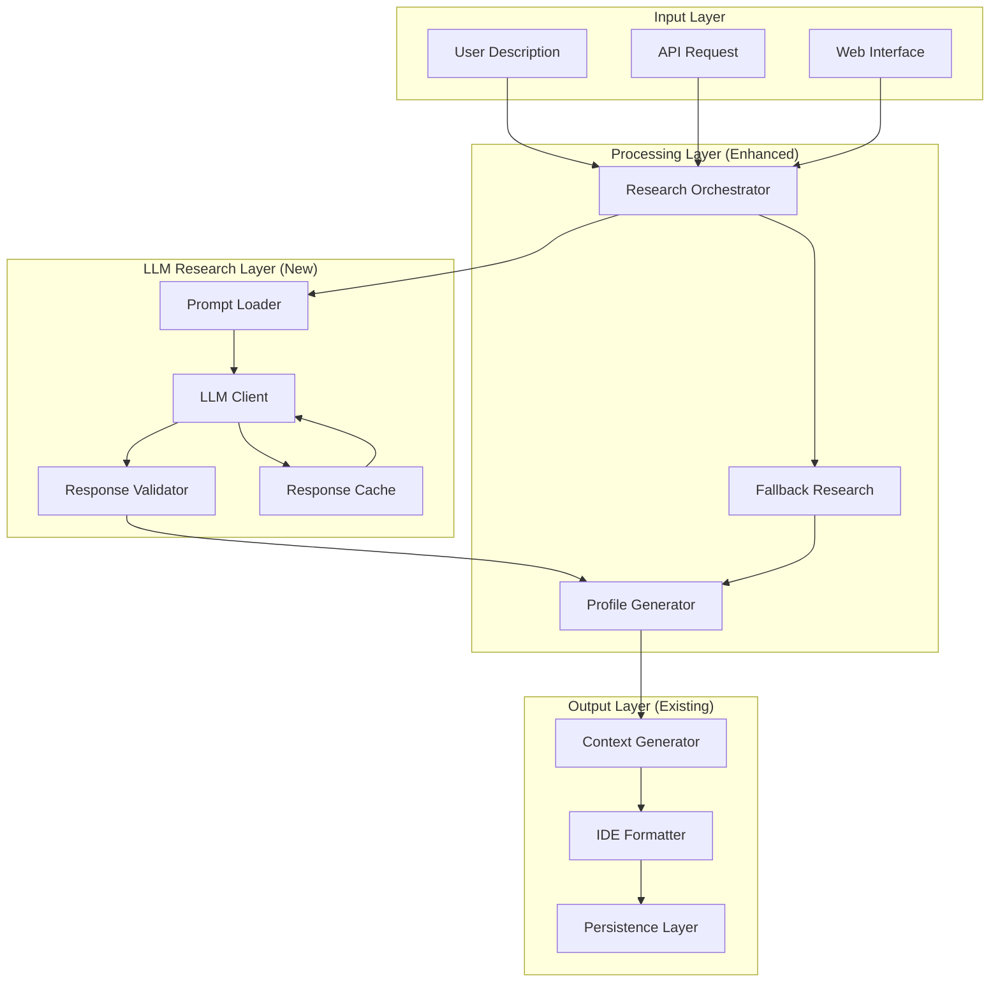

# Design Document

## Overview

The LLM-Driven Research System replaces the current hardcoded personality mapping approach with a dynamic, LLM-powered personality analysis system. The design follows functional programming principles, maintains minimal code changes, and integrates seamlessly with the existing architecture while providing configurable LLM prompts and structured response validation.

## Architecture

The system extends the existing research pipeline by introducing an LLM analysis layer between user input and personality profile generation. The architecture maintains the current functional approach while adding new components for LLM integration, prompt management, and response validation.



## Components and Interfaces

### LLM Integration Layer

#### Prompt Management System
```python
from typing import Dict, Optional, Any
from pathlib import Path
from dataclasses import dataclass

@dataclass
class PromptConfig:
    """Configuration for LLM prompts."""
    template: str
    variables: Dict[str, Any]
    max_tokens: int
    temperature: float
    model: str

async def load_prompt_config(prompt_file: Path) -> PromptConfig:
    """Load prompt configuration from file."""
    
async def render_prompt(config: PromptConfig, description: str) -> str:
    """Render prompt template with user description."""
```

#### LLM Client Interface
```python
from typing import Protocol, Dict, Any
from abc import abstractmethod

class LLMClient(Protocol):
    """Protocol for LLM client implementations."""
    
    @abstractmethod
    async def generate_response(
        self, 
        prompt: str, 
        max_tokens: int = 1000,
        temperature: float = 0.7
    ) -> str:
        """Generate response from LLM."""
        
    @abstractmethod
    async def validate_connection(self) -> bool:
        """Validate LLM service connection."""

# Functional implementations
async def create_openai_client(api_key: str, model: str) -> LLMClient
async def create_anthropic_client(api_key: str, model: str) -> LLMClient
async def create_local_client(endpoint: str, model: str) -> LLMClient
```

#### Response Validation System
```python
from pydantic import BaseModel, Field, validator
from typing import List, Optional

class LLMPersonalityResponse(BaseModel):
    """Structured response from LLM personality analysis."""
    name: str = Field(..., description="Personality name or title")
    type: str = Field(..., description="celebrity, fictional, archetype, or custom")
    description: str = Field(..., description="Brief personality description")
    traits: List[LLMTrait] = Field(..., description="List of personality traits")
    communication_style: LLMCommunicationStyle = Field(..., description="Communication preferences")
    mannerisms: List[str] = Field(default_factory=list, description="Behavioral patterns")
    confidence: float = Field(..., ge=0.0, le=1.0, description="Analysis confidence score")

class LLMTrait(BaseModel):
    """Individual personality trait from LLM analysis."""
    trait: str = Field(..., description="Trait name")
    intensity: int = Field(..., ge=1, le=10, description="Trait intensity 1-10")
    description: str = Field(..., description="Trait explanation")

class LLMCommunicationStyle(BaseModel):
    """Communication style from LLM analysis."""
    tone: str = Field(..., description="Overall tone")
    formality: str = Field(..., description="casual, formal, or mixed")
    verbosity: str = Field(..., description="concise, moderate, or verbose")
    technical_level: str = Field(..., description="beginner, intermediate, or expert")

async def validate_llm_response(response_text: str) -> LLMPersonalityResponse:
    """Validate and parse LLM response into structured format."""

async def convert_llm_to_profile(llm_response: LLMPersonalityResponse) -> PersonalityProfile:
    """Convert LLM response to internal PersonalityProfile format."""
```

### Enhanced Research Orchestrator

The existing research orchestrator will be enhanced to integrate LLM analysis as the primary research method:

```python
from typing import Optional, List
from ..models.core import ResearchResult, PersonalityProfile

async def research_personality_with_llm(
    description: str,
    llm_client: LLMClient,
    prompt_config: PromptConfig,
    cache_client: Optional[CacheClient] = None
) -> ResearchResult:
    """Primary research function using LLM analysis."""

async def fallback_research_personality(description: str) -> ResearchResult:
    """Fallback to existing research methods when LLM fails."""

async def research_personality(description: str) -> ResearchResult:
    """Main research function with LLM-first approach and fallbacks."""
```

### Configuration Management

#### Prompt Configuration Files
Prompts will be stored in configurable YAML files:

```yaml
# config/prompts/personality_analysis.yaml
name: "personality_analysis"
version: "1.0"
model: "gpt-4"
max_tokens: 1000
temperature: 0.7
template: |
  You are a personality analysis expert. Analyze the following personality description and provide structured information.
  
  Description: "{description}"
  
  Please provide your analysis in the following JSON format:
  {{
    "name": "Personality name or title",
    "type": "celebrity|fictional|archetype|custom",
    "description": "Brief personality summary",
    "traits": [
      {{
        "trait": "trait name",
        "intensity": 1-10,
        "description": "explanation of this trait"
      }}
    ],
    "communication_style": {{
      "tone": "overall tone description",
      "formality": "casual|formal|mixed",
      "verbosity": "concise|moderate|verbose", 
      "technical_level": "beginner|intermediate|expert"
    }},
    "mannerisms": ["behavioral pattern 1", "behavioral pattern 2"],
    "confidence": 0.0-1.0
  }}
  
  Focus on traits relevant to coding assistance and technical communication.
variables:
  description: "User personality description"
```

#### LLM Provider Configuration
```yaml
# config/llm/providers.yaml
providers:
  openai:
    api_key_env: "OPENAI_API_KEY"
    base_url: "https://api.openai.com/v1"
    models:
      - "gpt-4"
      - "gpt-3.5-turbo"
    default_model: "gpt-4"
    
  anthropic:
    api_key_env: "ANTHROPIC_API_KEY"
    base_url: "https://api.anthropic.com"
    models:
      - "claude-3-opus"
      - "claude-3-sonnet"
    default_model: "claude-3-sonnet"
    
  local:
    base_url: "http://localhost:11434"
    models:
      - "llama2"
      - "mistral"
    default_model: "llama2"

default_provider: "openai"
fallback_providers: ["anthropic", "local"]
```

## Data Models

### Enhanced Core Models

The existing PersonalityProfile model will be extended to support LLM-generated data:

```python
from pydantic import BaseModel, Field
from typing import Optional, Dict, Any
from datetime import datetime

class LLMResearchSource(ResearchSource):
    """Extended research source for LLM-generated data."""
    llm_provider: str = Field(..., description="LLM provider used")
    llm_model: str = Field(..., description="Specific model used")
    prompt_version: str = Field(..., description="Prompt template version")
    raw_response: Optional[str] = Field(None, description="Raw LLM response")
    processing_time: float = Field(..., description="Response generation time")

class EnhancedPersonalityProfile(PersonalityProfile):
    """Enhanced personality profile with LLM metadata."""
    llm_metadata: Optional[Dict[str, Any]] = Field(None, description="LLM generation metadata")
    fallback_used: bool = Field(False, description="Whether fallback research was used")
```

### Cache Models

```python
class CachedLLMResponse(BaseModel):
    """Cached LLM response for similar queries."""
    query_hash: str = Field(..., description="Hash of normalized query")
    response: LLMPersonalityResponse = Field(..., description="Cached response")
    created_at: datetime = Field(..., description="Cache creation time")
    expires_at: datetime = Field(..., description="Cache expiration time")
    hit_count: int = Field(default=1, description="Number of cache hits")
```

## Error Handling

### LLM-Specific Error Types

```python
class LLMError(Exception):
    """Base class for LLM-related errors."""
    pass

class LLMConnectionError(LLMError):
    """LLM service connection failed."""
    pass

class LLMRateLimitError(LLMError):
    """LLM service rate limit exceeded."""
    retry_after: int
    
class LLMValidationError(LLMError):
    """LLM response validation failed."""
    raw_response: str
    validation_errors: List[str]

class LLMTimeoutError(LLMError):
    """LLM request timed out."""
    timeout_duration: float
```

### Error Handling Strategy

1. **LLM Failures**: Fall back to existing research methods
2. **Validation Failures**: Attempt response repair or request regeneration
3. **Rate Limits**: Implement exponential backoff and provider switching
4. **Network Issues**: Queue requests and retry with different providers

## Integration Points

### Minimal Code Changes

The design minimizes changes to existing code by:

1. **Extending Research Function**: The main `research_personality()` function will be enhanced to try LLM analysis first, then fall back to existing methods
2. **Preserving Interfaces**: All existing API endpoints and return types remain unchanged
3. **Adding Configuration**: New configuration files are added without modifying existing ones
4. **Functional Approach**: All new components follow the existing functional programming patterns

### Modified Files

1. **`src/covibe/services/research.py`**: Enhanced with LLM integration
2. **`src/covibe/services/llm_client.py`**: New LLM client implementations
3. **`src/covibe/services/prompt_manager.py`**: New prompt management functions
4. **`src/covibe/utils/validation.py`**: Enhanced with LLM response validation
5. **`config/`**: New directory for prompt and LLM configuration files

### New Dependencies

```toml
# Additional dependencies for LLM integration
dependencies = [
    "openai>=1.0.0",
    "anthropic>=0.8.0", 
    "tiktoken>=0.5.0",  # Token counting
    "jinja2>=3.1.0",    # Prompt templating (already included)
    "pyyaml>=6.0.0",    # Configuration files
    "redis>=4.0.0",     # Optional: Response caching
]
```

## Testing Strategy

### Unit Testing
- **LLM Client Functions**: Mock LLM responses and test error handling
- **Prompt Management**: Test template loading and rendering
- **Response Validation**: Test structured response parsing and validation
- **Cache Functions**: Test cache hit/miss scenarios and expiration

### Integration Testing
- **End-to-End LLM Flow**: Test complete personality analysis pipeline
- **Fallback Scenarios**: Test fallback to existing research methods
- **Provider Switching**: Test switching between LLM providers
- **Configuration Loading**: Test prompt and provider configuration loading

### Performance Testing
- **Response Times**: Ensure LLM integration doesn't significantly slow research
- **Cache Effectiveness**: Measure cache hit rates and performance improvements
- **Concurrent Requests**: Test system behavior under load with LLM rate limits

### Security Testing
- **API Key Management**: Test secure handling of LLM provider API keys
- **Input Sanitization**: Test prompt injection prevention
- **Response Validation**: Test handling of malicious or malformed LLM responses

## Deployment Considerations

### Environment Variables
```bash
# LLM Provider API Keys
OPENAI_API_KEY=sk-...
ANTHROPIC_API_KEY=sk-ant-...

# Optional: Redis for caching
REDIS_URL=redis://localhost:6379

# Configuration paths
PROMPT_CONFIG_PATH=./config/prompts
LLM_CONFIG_PATH=./config/llm
```

### Configuration Management
- Prompt files can be updated without code deployment
- LLM provider configuration supports hot-reloading
- Cache settings are configurable per environment

### Monitoring and Observability
- LLM request/response logging
- Performance metrics for LLM vs fallback research
- Cost tracking for LLM API usage
- Error rate monitoring for different providers