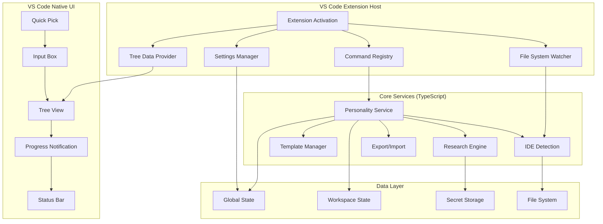

# Design Document

## Overview

This design document outlines the architecture for packaging the Covibe Agent Personality System as a native VS Code extension. The approach prioritizes simplicity, performance, and maintainability by implementing core functionality directly in TypeScript and leveraging VS Code's built-in UI components and APIs.

The design follows a lean architecture where business logic is implemented in TypeScript, UI interactions use native VS Code components (Quick Pick, Input Box, Tree View), and the extension integrates seamlessly with VS Code's workspace and security models.

## Architecture

### High-Level Architecture



### Component Architecture

The extension consists of three main architectural layers:

1. **Extension Host Layer** - VS Code integration and lifecycle management
2. **Core Services Layer** - Business logic implemented in TypeScript
3. **UI Layer** - Native VS Code UI components (no webviews)

## Components and Interfaces

### 1. Extension Host Components

#### Extension Activation (`src/extension.ts`)
- **Purpose**: Minimal entry point with lazy loading
- **Responsibilities**:
  - Register activation events
  - Initialize core services on demand
  - Set up command handlers
  - Manage extension lifecycle

```typescript
export async function activate(context: vscode.ExtensionContext) {
  // Lazy initialization
  const activationTelemetry = new ActivationTelemetry();
  await activationTelemetry.reportActivation();

  // Register commands with lazy service loading
  const commandManager = new CommandManager(context);
  await commandManager.registerCommands();

  // Set up workspace trust handler
  const trustHandler = new WorkspaceTrustHandler();
  context.subscriptions.push(trustHandler);
}
```

#### Command Manager (`src/commands/commandManager.ts`)
- **Purpose**: Centralized command registration with lazy loading
- **Responsibilities**:
  - Register all extension commands
  - Handle command execution with error boundaries
  - Track command usage telemetry
  - Manage keyboard shortcuts

```typescript
interface ICommandManager {
  registerCommands(): Promise<void>;
  executeCommand(command: string, ...args: any[]): Promise<void>;
  getCommandHistory(): CommandHistoryEntry[];
}
```

#### Personality Tree Provider (`src/views/personalityTreeProvider.ts`)
- **Purpose**: Display personalities in sidebar using native tree view
- **Responsibilities**:
  - Render personality list with status indicators
  - Provide inline actions (activate, edit, delete, export)
  - Handle drag-and-drop for reordering
  - Show personality details on hover

```typescript
class PersonalityTreeProvider implements vscode.TreeDataProvider<PersonalityItem> {
  getTreeItem(element: PersonalityItem): vscode.TreeItem {
    const item = new vscode.TreeItem(element.name);
    item.contextValue = element.isActive ? 'activePersonality' : 'personality';
    item.iconPath = new vscode.ThemeIcon(element.icon);
    item.description = element.description;
    item.tooltip = new vscode.MarkdownString(element.getTooltip());
    return item;
  }
}
```

### 2. Core Services Layer (TypeScript Implementation)

#### Personality Service (`src/services/personalityService.ts`)
- **Purpose**: Core business logic for personality management
- **Responsibilities**:
  - Create, read, update, delete personalities
  - Apply personalities to workspace files
  - Manage personality templates
  - Handle personality validation

```typescript
interface IPersonalityService {
  createPersonality(description: string): Promise<Personality>;
  getPersonalities(): Promise<Personality[]>;
  activatePersonality(id: string): Promise<void>;
  updatePersonality(id: string, updates: Partial<Personality>): Promise<void>;
  deletePersonality(id: string): Promise<void>;
  exportPersonality(id: string): Promise<string>;
  importPersonality(data: string): Promise<Personality>;
}
```

#### Research Engine (`src/services/researchEngine.ts`)
- **Purpose**: Generate personality configurations from descriptions
- **Responsibilities**:
  - Parse and analyze personality descriptions
  - Generate personality traits and context
  - Use template matching for offline support
  - Integrate with AI services when available

```typescript
interface IResearchEngine {
  research(description: string, options?: ResearchOptions): Promise<ResearchResult>;
  getTemplates(): Promise<PersonalityTemplate[]>;
  matchTemplate(description: string): Promise<PersonalityTemplate | null>;
  validatePersonality(personality: Personality): ValidationResult;
}
```

#### IDE Detection Service (`src/services/ideDetection.ts`)
- **Purpose**: Detect and manage AI IDE configuration files
- **Responsibilities**:
  - Scan workspace for supported IDE files
  - Monitor file changes
  - Update IDE configurations
  - Handle multi-root workspaces

```typescript
interface IIDEDetectionService {
  detectIDEFiles(workspace: vscode.WorkspaceFolder): Promise<IDEFile[]>;
  watchIDEFiles(): vscode.Disposable;
  applyPersonalityToIDE(personality: Personality, ideFile: IDEFile): Promise<void>;
  backupIDEFile(ideFile: IDEFile): Promise<string>;
}
```

### 3. UI Layer (Native VS Code Components)

#### Quick Pick UI (`src/ui/quickPick.ts`)
- **Purpose**: Replace custom forms with native quick pick
- **Usage**: Personality selection, template choice, options

```typescript
async function showPersonalityQuickPick(): Promise<Personality | undefined> {
  const personalities = await personalityService.getPersonalities();
  const items: vscode.QuickPickItem[] = personalities.map(p => ({
    label: p.name,
    description: p.isActive ? '$(check) Active' : '',
    detail: p.description
  }));
  
  return vscode.window.showQuickPick(items, {
    placeHolder: 'Select a personality to activate',
    matchOnDescription: true,
    matchOnDetail: true
  });
}
```

#### Input Validation (`src/ui/inputValidation.ts`)
- **Purpose**: Validate user input with immediate feedback
- **Usage**: Personality names, descriptions, import data

```typescript
async function showPersonalityInput(): Promise<string | undefined> {
  return vscode.window.showInputBox({
    prompt: 'Describe the AI personality you want',
    placeHolder: 'e.g., Expert TypeScript developer focused on clean code',
    validateInput: (value) => {
      if (!value || value.length < 10) {
        return 'Please provide a more detailed description';
      }
      if (value.length > 500) {
        return 'Description is too long (max 500 characters)';
      }
      return null;
    }
  });
}
```

#### Progress Indicators (`src/ui/progress.ts`)
- **Purpose**: Show progress for long-running operations
- **Usage**: Research, import/export, batch operations

```typescript
async function withProgress<T>(
  title: string,
  task: (progress: vscode.Progress<{ message?: string; increment?: number }>) => Promise<T>
): Promise<T> {
  return vscode.window.withProgress({
    location: vscode.ProgressLocation.Notification,
    title,
    cancellable: true
  }, task);
}
```

## Data Models

### Core Models
```typescript
interface Personality {
  id: string;
  name: string;
  description: string;
  traits: PersonalityTrait[];
  context: string;
  isActive: boolean;
  workspaceId?: string;
  created: Date;
  modified: Date;
  version: string;
}

interface PersonalityTrait {
  category: 'technical' | 'communication' | 'workflow' | 'values';
  name: string;
  value: string;
  priority: 'high' | 'medium' | 'low';
}

interface IDEFile {
  path: string;
  type: 'claude' | 'cursor' | 'windsurf' | 'continue';
  content: string;
  lastModified: Date;
  workspaceFolder: vscode.WorkspaceFolder;
}
```

### Settings Schema
```typescript
interface ExtensionSettings {
  // Core settings
  defaultPersonality?: string;
  autoActivatePersonality: boolean;
  
  // UI preferences
  showStatusBar: boolean;
  treeViewLocation: 'explorer' | 'separate';
  
  // Advanced features (progressive enhancement)
  enableAIResearch: boolean;
  researchProvider: 'offline' | 'openai' | 'anthropic';
  
  // Security
  enableTelemetry: boolean;
  trustWorkspaceOnly: boolean;
  
  // Experimental
  experimentalFeatures: {
    smartTemplates: boolean;
    autoSync: boolean;
  };
}
```

## Security and Privacy

### Workspace Trust Integration
```typescript
class WorkspaceTrustHandler {
  constructor() {
    vscode.workspace.onDidGrantWorkspaceTrust(() => this.enableFullFeatures());
    vscode.workspace.onDidRevokeWorkspaceTrust(() => this.restrictFeatures());
  }
  
  private restrictFeatures() {
    // Disable file system writes
    // Disable network requests
    // Use read-only mode
  }
}
```

### Input Sanitization
```typescript
class InputSanitizer {
  static sanitize(input: string): string {
    return input
      .replace(/[<>]/g, '') // Remove potential HTML
      .replace(/\$/g, '') // Remove command substitution
      .trim()
      .substring(0, MAX_INPUT_LENGTH);
  }
}
```

### Secure Storage
```typescript
class SecureStorageService {
  constructor(private secrets: vscode.SecretStorage) {}
  
  async storeApiKey(provider: string, key: string): Promise<void> {
    await this.secrets.store(`covibe.${provider}.apiKey`, key);
  }
  
  async getApiKey(provider: string): Promise<string | undefined> {
    return this.secrets.get(`covibe.${provider}.apiKey`);
  }
}
```

## Telemetry and Analytics

### Privacy-Respecting Telemetry
```typescript
class TelemetryService {
  private reporter?: TelemetryReporter;
  
  constructor() {
    if (vscode.env.isTelemetryEnabled) {
      this.reporter = new TelemetryReporter(extensionId, extensionVersion, aiKey);
    }
  }
  
  trackEvent(eventName: string, properties?: Record<string, string>) {
    if (!this.reporter) return;
    
    // Sanitize and anonymize data
    const sanitizedProps = this.sanitizeProperties(properties);
    this.reporter.sendTelemetryEvent(eventName, sanitizedProps);
  }
}
```

### Error Reporting
```typescript
class ErrorReporter {
  static report(error: Error, context?: ErrorContext) {
    // Log locally first
    console.error('Extension error:', error);
    
    // Show user-friendly notification
    const actions: vscode.MessageItem[] = [
      { title: 'Report Issue' },
      { title: 'View Logs' }
    ];
    
    vscode.window.showErrorMessage(
      `Covibe: ${error.message}`,
      ...actions
    ).then(selection => {
      if (selection?.title === 'Report Issue') {
        this.openGitHubIssue(error, context);
      }
    });
  }
}
```

## Performance Optimization

### Lazy Loading Strategy
```typescript
class LazyServiceLoader {
  private services = new Map<string, Promise<any>>();
  
  async getService<T>(name: string, factory: () => Promise<T>): Promise<T> {
    if (!this.services.has(name)) {
      this.services.set(name, factory());
    }
    return this.services.get(name) as Promise<T>;
  }
}
```

### Efficient File Operations
```typescript
class FileOperationQueue {
  private queue: FileOperation[] = [];
  private processing = false;
  
  async enqueue(operation: FileOperation) {
    this.queue.push(operation);
    if (!this.processing) {
      await this.process();
    }
  }
  
  private async process() {
    this.processing = true;
    while (this.queue.length > 0) {
      const batch = this.queue.splice(0, BATCH_SIZE);
      await Promise.all(batch.map(op => op.execute()));
    }
    this.processing = false;
  }
}
```

## Build and Distribution

### Build Configuration (esbuild)
```javascript
// esbuild.config.js
const esbuild = require('esbuild');

const production = process.argv.includes('--production');

esbuild.build({
  entryPoints: ['src/extension.ts'],
  bundle: true,
  outfile: 'out/extension.js',
  external: ['vscode'],
  format: 'cjs',
  platform: 'node',
  target: 'node16',
  sourcemap: !production,
  minify: production,
  treeShaking: true,
  metafile: true,
  plugins: [
    // Custom plugins for optimization
  ]
}).then(result => {
  // Analyze bundle size
  if (result.metafile) {
    const analysis = esbuild.analyzeMetafile(result.metafile);
    console.log(analysis);
  }
});
```

### Extension Packaging
```json
{
  "scripts": {
    "vscode:prepublish": "npm run esbuild-base -- --production",
    "esbuild-base": "node esbuild.config.js",
    "package": "vsce package --no-dependencies",
    "publish": "vsce publish",
    "pre-release": "vsce publish --pre-release"
  }
}
```

## Testing Strategy

### Unit Testing
```typescript
// src/test/suite/personalityService.test.ts
describe('PersonalityService', () => {
  let service: PersonalityService;
  let mockState: vscode.Memento;
  
  beforeEach(() => {
    mockState = new MockMemento();
    service = new PersonalityService(mockState);
  });
  
  it('should create personality from description', async () => {
    const personality = await service.createPersonality('Expert TypeScript developer');
    expect(personality.traits).toContainEqual(
      expect.objectContaining({ name: 'TypeScript expertise' })
    );
  });
});
```

### Integration Testing
```typescript
// src/test/integration/extension.test.ts
describe('Extension Integration', () => {
  it('should activate within 200ms', async () => {
    const start = Date.now();
    await vscode.extensions.getExtension('covibe.personality-system')?.activate();
    const duration = Date.now() - start;
    expect(duration).toBeLessThan(200);
  });
});
```

## Migration and Updates

### Settings Migration
```typescript
class SettingsMigration {
  static async migrate(context: vscode.ExtensionContext) {
    const currentVersion = context.extension.packageJSON.version;
    const lastVersion = context.globalState.get<string>('lastVersion');
    
    if (lastVersion && semver.lt(lastVersion, currentVersion)) {
      await this.runMigrations(lastVersion, currentVersion);
    }
    
    await context.globalState.update('lastVersion', currentVersion);
  }
}
```

This lean design ensures a fast, secure, and maintainable VS Code extension that leverages native capabilities while providing a seamless user experience.